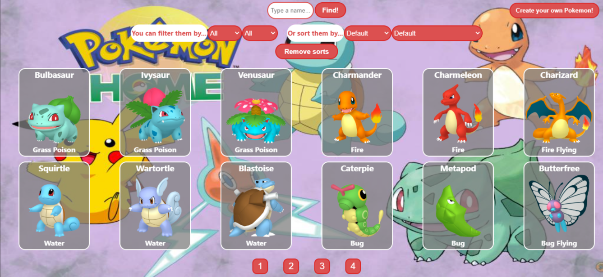
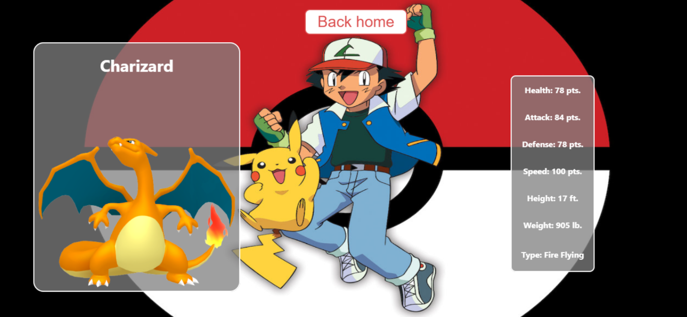
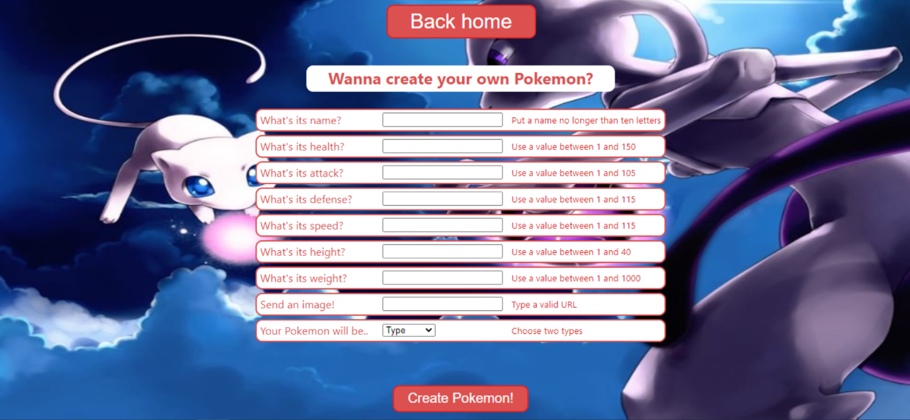

# Pokemon App

<p align="left">
  
</p>

## Podes probar la app con el siguiente link

- 🌎 Deploy: https://pokemon-app-henna.vercel.app/

## Objetivos del Proyecto y algunas imagenes

- Construir una App utlizando React, Redux, Node y Sequelize.
- Aprender mejores prácticas.
- Aprender y practicar el workflow de GIT.






## Comenzando

 1. Forkear el repositorio para tener una copia del mismo en sus cuentas
 2. Clonar el repositorio en sus computadoras

__IMPORTANTE:__ Es necesario contar minimamente con la última versión estable de Node y NPM. Asegurarse de contar con ella para poder instalar correctamente las dependecias necesarias para correr el proyecto.

Actualmente las versiónes necesarias son:

 * __Node__: 12.18.3 o mayor
 * __NPM__: 6.14.16 o mayor

Para verificar que versión tienen instalada:

> node -v
>
> npm -v

## BoilerPlate

El boilerplate cuenta con dos carpetas: `client` y `server`. En estas carpetas estará el código del front-end y el back-end respectivamente.

En `server` crear un archivo llamado: `.env` que tenga la siguiente forma:

```
DB_USER=usuariodepostgres
DB_PASSWORD=passwordDePostgres
DB_HOST=localhost
PORT=3001
```

Reemplazar `usuariodepostgres` y `passwordDePostgres` con tus propias credenciales para conectarte a postgres.

Adicionalmente será necesario que creen desde psql una base de datos llamada `pokemon`

El contenido de `client` fue creado usando: Create React App.

## Enunciado

La idea general es una aplicación en la cual se puedan ver los distintos Pokemon utilizando la api externa [pokeapi](https://pokeapi.co/) y a partir de ella poder, entre otras cosas:

  - Buscar pokemons
  - Filtrarlos / Ordenarlos
  - Crear nuevos pokemons

__IMPORTANTE__: Para las funcionalidades de filtrado y ordenamiento NO se utilizaron los endpoints de la API externa que ya devuelven los resultados filtrados u ordenados sino que están construidos propiamente en la aplicación.

### Únicos Endpoints/Flags externos usados

  - GET https://pokeapi.co/api/v2/pokemon
  - GET https://pokeapi.co/api/v2/type

### Requerimientos mínimos:

__IMPORTANTE__: Para aplicar estilos a la aplicación se utilizo CSS Modules.

#### Tecnologías necesarias:
- React
- Redux Toolkit
- Express
- Sequelize - Postgres

## Frontend

La aplicación contiene las siguientes pantallas/rutas.

__Pagina inicial__: una landing page con botón para ingresar al home (`Ruta principal`)

__Ruta principal__: contiene
- Input de búsqueda para encontrar pokemons por nombre (La búsqueda es exacta, es decir solo encontrará al pokemon si se coloca el nombre completo)
- Área donde se ve el listado de pokemons mostrando su:
  - Imagen
  - Nombre
  - Tipos (Electrico, Fuego, Agua, etc)
- Botones/Opciones para filtrar por tipo de pokemon y por pokemon existente o creado por el usuario
- Botones/Opciones para ordenar tanto ascendentemente como descendentemente los pokemons por orden alfabético y por fuerza
- Paginado para ir buscando y mostrando los siguientes pokemons, 12 pokemons por pagina.

__IMPORTANTE__: Dentro de la Ruta Principal se muestran tanto los pokemons traidos desde la API como así también los de la base de datos. Por otro lado, para traer la información de los pokemon fue necesario hacer un subrequest y obtener los datos necesarios desde ahí. Debido a que esto puede hacer que la búsqueda sea muy lenta se limitó el resultado total a 40 pokemons provenientes de la API externa.

__Ruta de detalle de Pokemon__: contiene
- Los campos mostrados en la ruta principal para cada pokemon (imagen, nombre y tipos)
- Estadísticas (vida, fuerza, defensa, velocidad)
- Altura y peso

__Ruta de creación__: contiene
- Un formulario __controlado y validado con JavaScript__ con los campos mencionados en el detalle del Pokemon
- Posibilidad de seleccionar/agregar más de un tipo de Pokemon
- Botón/Opción para crear un nuevo Pokemon

## Base de datos

El modelo de la base de datos tiene las siguientes entidades:

- Pokemon con, en principio y por el momento, las siguientes propiedades:
  - ID
  - Nombre
  - Vida
  - Fuerza
  - Defensa
  - Velocidad
  - Altura
  - Peso
- Tipo con las siguientes propiedades:
  - ID
  - Nombre

La relación entre ambas entidades es de muchos a muchos ya que un pokemon puede pertenecer a más de un tipo y, a su vez, un tipo puede incluir a muchos pokemons.

## Backend

Está desarrollado un servidor en Node/Express con las siguientes rutas:

- __GET /pokemons__:
  - Obtiene un listado de los pokemons desde pokeapi y desde la base de datos.
- __GET /pokemons/{idPokemon}__:
  - Obtiene el detalle de un pokemon en particular a partir de su id
- __GET /pokemons?name="..."__:
  - Obtiene el pokemon que coincide exactamente con el nombre pasado como query parameter (Puede ser de pokeapi o creado por nosotros)
- __POST /pokemons__:
  - Recibe los datos recolectados desde el formulario controlado de la ruta de creación de pokemons por body
  - Crea un pokemon en la base de datos
- __GET /types__:
  - Obtiene todos los tipos de pokemons posibles
